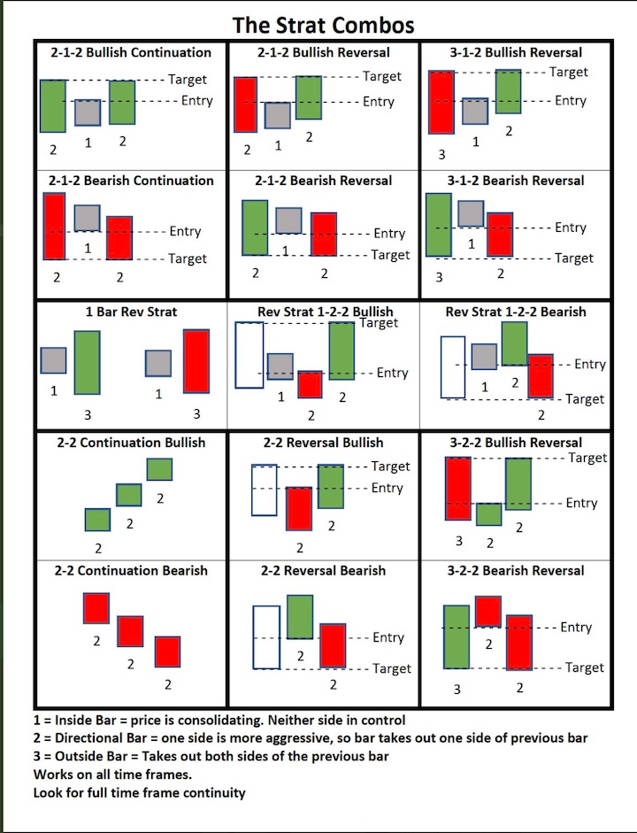
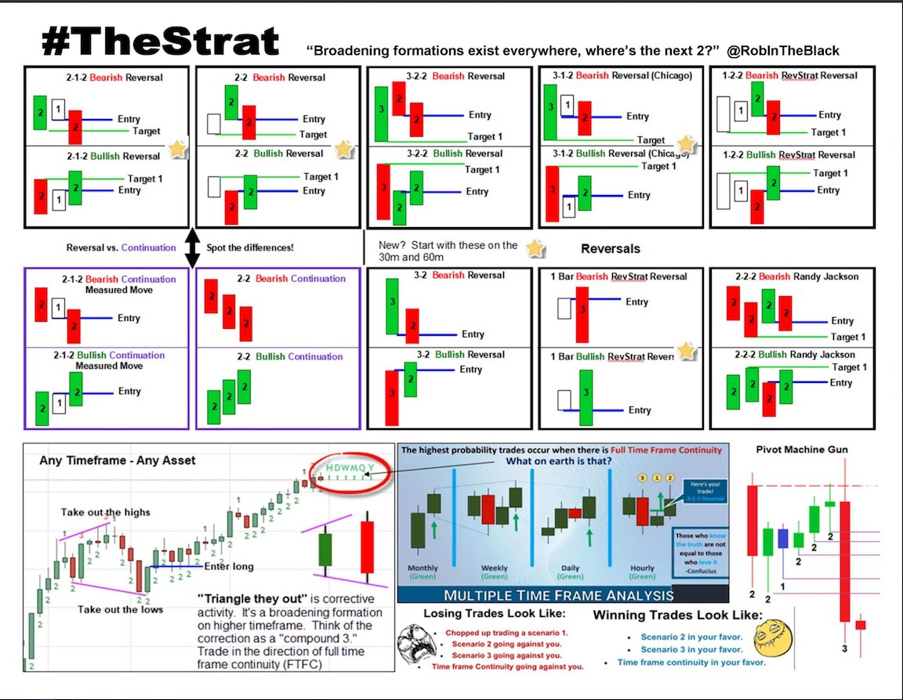
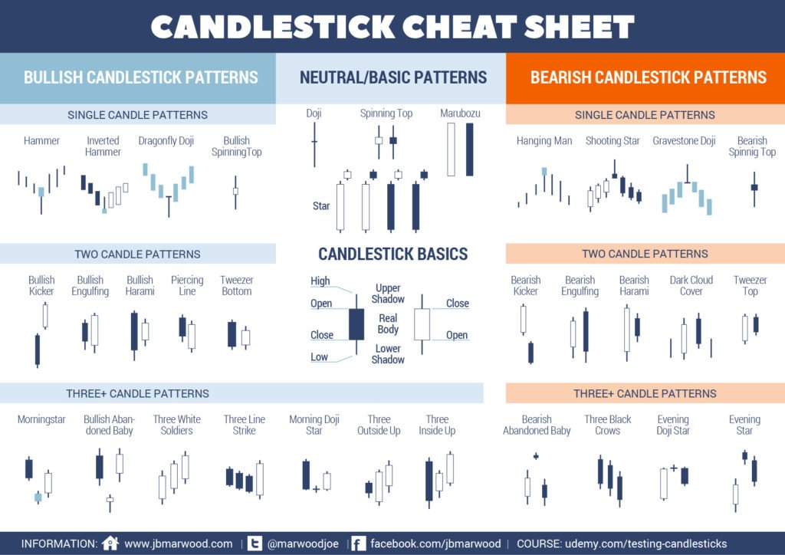

# The STRAT
All things strat related for stock trading, a methodology created by Rob Smith.  Knowledge should be collaborative and shared, not behind a paid wall.  Want to contribute?  Let me know ask for collaborator request.  Twitter @rickyzane85

# Table of Contents

# Overview
TheSTRAT is a trading method developed by Rob Smith (@RobInTheBlack).  

Before beginning you have to have a basic understanding of candlesticks 
There are two major parts to TheSTRAT
* Candle / Pricing Action
  * 1 Candle
    * Names: 1 Candle / Inside Bar / Inside Action / Consolidation / Sideways
    * Technical: occur when the current candle falls completely within the prior candle
    * Meaning: balance, equilibrium, buyers and sellers agree on price, no one is in control
    * Action: nothing, never trade a one bar, wait for the consolidation to stop then it's time to get into a trade
  * 2 Candle
    * Names: 2 Candle / Directional Bar / 2 Down / 2 Up
    * Technical: occur when the current candle takes out one side of the prior candle
      * A 2 down means it took out the previous candle's low, but failed to take out the high
      * A 2 up means it took out the previous candle's high, but failed to take out the low
    * Meaning: 
  * 3 Bar/Outside Bars - Outside Bars occur when the current candle takes out both sides of the prior candle.
There are also a few important principles to keep in mind:

Time Frame Continuity - Price direction is best assessed by looking at multiple timeframes rather than moving averages or other lagging indicators. The ideal situation occurs when all time frames point in the same direction, which is known as Full Time Frame Continuity.
Broadening Formations - The emergence of Directional Bars and Outside Bars create Broadening Formations that fit into a triangle and ultimately lead to reversals or expansions where trading opportunities may be present.
Inside Bars - Inside Bars are the key decision point when the market reaches equilibrium and must decide where prices are going in the immediate future.

# Detail

# Help
## Cheat Sheets
#### STRAT Cheat Sheet1

#### STRAT Cheat Sheet2

#### Candlestick Cheat Sheet

## Acronyms and Terms
* AH: After Hours - stock trading after the market closes 4PM EST
* PM: PreMarket - stock trading before the market opens 9:30AM EST
* LOD: Low of Day - the low stock price of the day
* NHOD: New High of Day - stock made a new high price of the day
* ATR: Average True Range - volatility indicator, from the 14-day simple moving average of a series of true range indicators using highs and lows
* EOD: End of Day - end of the stock trading day 4PM EST
* EPS: Earnings Per Share - a company's earnings per share outstanding
* MM: Market Maker - company or an individual that quotes both a buy and a sell price, hoping to make a profit on the bid–ask spread
* PDT: Pattern Day Trader - traders who trade 4+ day trades over the span of 5 business days on a margin account get their account flagged with this
* WW: Worth Watching - keep an eye on a this stock
* ORB: Opening Range Break - when a price breaks above or below the previous candle high or low from the open, used on 15, 30 or 60 mins from open
* ORH: Opening Range High - the high price of a stock from the opening range (15, 30 or 60 mins from market open), monitored to see when it "breaks"
* ORL: Opening Range Low - the low price of a stock from the opening range (15, 30 or 60 mins from market open), monitored to see when it "breaks"
* VWAP: Volume Weighted Average Price - statistic used by traders to determine what the average price is based on both price and volume
* SMA: Simple Moving Average - moving average calculated by adding recent prices and then dividing that figure by the number of time periods
* EMA: Exponential moving Average - type of moving average that places a greater weight and significance on the most recent data points
* MAG: Magnitude - how far a price run is
* BF: Broadening Formation
* MTFA: Multiple Time Frame Analysis
* AS: Actionable Signal
* FTC: Full Time Frame Continuity
* The Flip: New candle
* TTO: Triangle, They Out (corrective pullback/activity
* 5'r: 5 min candle
* 15'r: 15 min candle
* ER: Exhaustion Risk - 
* 60'r: 1 hour candle
* ETH: extended trading hours
* APTR: Average Percentage True Range - indicator to measure the volatility by percentage of a stock with price being neutral

* 2-2-2: multiple "2" outside bars in a row - aggresive pattern that a trend is continuing 

## Links and Tools

### Social Media

#### Youtube
https://www.youtube.com/user/smithsintheblack
https://www.youtube.com/user/ssabatino84
https://www.youtube.com/channel/UCYllJ4eRU4wDVSbZ9pHIJKA

#### Twitter
* @RobInTheBlack is the creator 	
* @LevJampolsky
* @AlexsOptions 	
* @TradeSniperSara
* @CyberDog2		
* @jam_trades  		
* @_JamesBradley__		
* @japor3		
* @WayoftheMaster7	
* @ADBYNOT		
* @chucknfones		
* @OptionizerSS
* @r3dpepsi		
* @Banker_L83		
* @R2DayTrades		
* @FranknBear 
* @StratDevilDog	
* @yogajen70		
* @toddjostendorf 		
* @ElaineBenes99 

### Scripts
* TD Ameritrade Think of Swim Scripts
  * https://usethinkscript.com/threads/rob-smiths-the-strat-indicator-for-thinkorswim.3312/
* Trading View Scripts
  *  Just search for The Strat
  *  https://www.tradingview.com/script/0WOo54ab-Candle-Type-The-Strat/
  *  https://www.tradingview.com/script/idDydr1G-TheStratHelper/
  *  https://www.tradingview.com/script/9QtwuoHf-Timeframe-Continuity/

### News
* CNBC - premarket
  * https://www.cnbc.com/2021/06/18/stocks-making-the-biggest-moves-in-the-premarket-adobe-smith-wesson-orphazyme-more.html?&qsearchterm=premarket
* Fed Reserve Calendar & Events
  * https://www.federalreserve.gov/newsevents/calendar.htm
* Economic Calendar
  * https://research.investors.com/economic-calendar/
* Upcoming Earnings
  * https://www.earningswhispers.com/calendar

### Analysis
* Marketwatch: upgrades & downgrades
  * https://www.marketwatch.com/tools/upgrades-downgrades
* Analyst Consensus
  * https://www.tipranks.com/
* Short Interest
  * https://www.marketwatch.com/tools/screener/short-interest

### Tools
* Good explanation of TheStrat
  * https://www.newtraderu.com/2019/02/13/what-do-we-know-to-be-true-about-price-action/
* StratFlix - great list of strat videos
  * https://drive.google.com/file/d/1-P-ADhAwqg30pzVSdqzJfprUks02eTu6/view
* Tons of free books
  * https://drive.google.com/drive/folders/1eIpH0RyJCGCQvhHZ8miP-DaGwU9bWqLb
  * https://www.marketgauge.com/TradingThe10OclockBulls.pdf
* Options Calculator
  * https://www.optionsprofitcalculator.com/
* Charting
  * https://www.tradingview.com/
* Automating Trades
  * https://ninjatrader.com/
* Market / Timeframe Alerts
  * http://mindtheflip.com/#
* Finviz Sector Tool
  * https://finviz.com/groups.ashx

### Exchanges
* TD Ameritrade
  * https://www.tdameritrade.com/home.html
* E-Trade
  * https://us.etrade.com/home/welcome-back
* Webull
  * https://www.webull.com/center
* Interactive Brokers
  * https://www.interactivebrokers.com/en/home.php
* Robinhood
  * https://robinhood.com/us/en/
